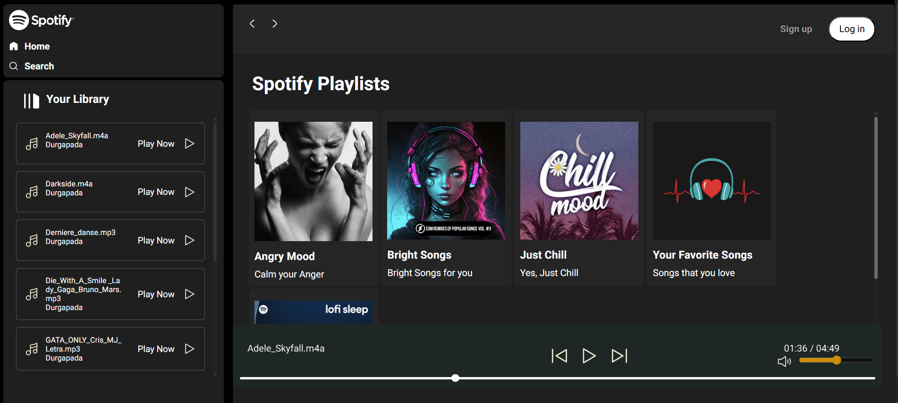
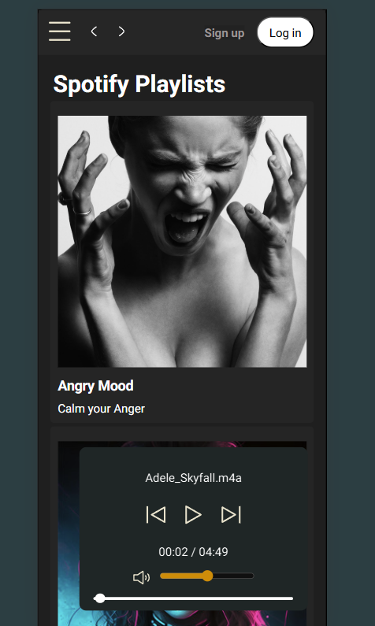
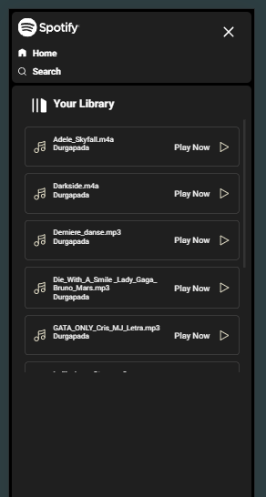

# 🎵 Spotify Clone

A fully responsive **Spotify Clone** built using HTML, CSS, and JavaScript.  
This project recreates the look and feel of Spotify’s modern music player interface, designed for both **desktop** and **mobile** screens.

---

## 🖼️ Project Preview

| 💻 Desktop View | 📱 Mobile View |
|:--:|:--::--:|
|  |  | |  ||

> 📝 *Replace these image paths with your actual file names or GitHub image URLs if needed.*

---

## 🚀 Features

- 🎧 Music player with play/pause and skip controls  
- 🎵 Playlist and album view  
- 🖥️ Modern Spotify-inspired UI  
- 📱 Fully responsive design for desktop and mobile  
- 💚 Smooth transitions and clean layout  

---

## 🛠️ Built With

- **HTML5** – Structure of the web app  
- **CSS3** – Styling, animations, and responsive layout  
- **JavaScript (ES6)** – Functionality and interactivity  

---

## 📂 Folder Structure

```
Spotify-Clone/
│
├── index.html
├── style.css
├── script.js
├── ima/
├── images/
│   ├── desktop-view.png
│   ├── mobile-view-1.png
│   └── mobile-view-2.png
└── songs/
```

---

## 🧑‍💻 How to Run Locally

1. **Clone this repository**
   ```bash
   git clone https://github.com/DURGAPADA80/Spotify-Clone.git
   ```

2. **Navigate to the project folder**
   ```bash
   cd Spotify-Clone
   ```

3. **Open the project**
   - Just open `index.html` in your browser,  
     or use VS Code Live Server to preview it.

---

## 🌟 Future Enhancements

- 🎚️ Add real-time audio visualizer  
- 🎼 Connect to Spotify Web API  
- 🕹️ Create dynamic playlists  
- 🌓 Add dark/light theme toggle  

---

## 📸 Screenshots

### 💻 Desktop Preview


### 📱 Mobile Preview


---

## 🧠 Learning Outcome

Through this project, I strengthened my skills in:
- Frontend UI design  
- JavaScript DOM manipulation  
- Responsive web development  
- Git & GitHub collaboration  

---

## 📬 Author

**👨‍💻 Durgapada Karan**  
🎯 B.Tech CSE (AI & ML) | Aspiring Backend Developer  
🔗 [GitHub Profile](https://github.com/DURGAPADA80)

> Feel free to fork ⭐ this repo or open an issue for suggestions!

---

### 🖼️ Example Image Folder Structure
```
images/
      │── desktop-view.png
      ├── mobile-view-1.png
      └── mobile-view-2.png
```

---

⭐ **If you like this project, please give it a star on GitHub!**
